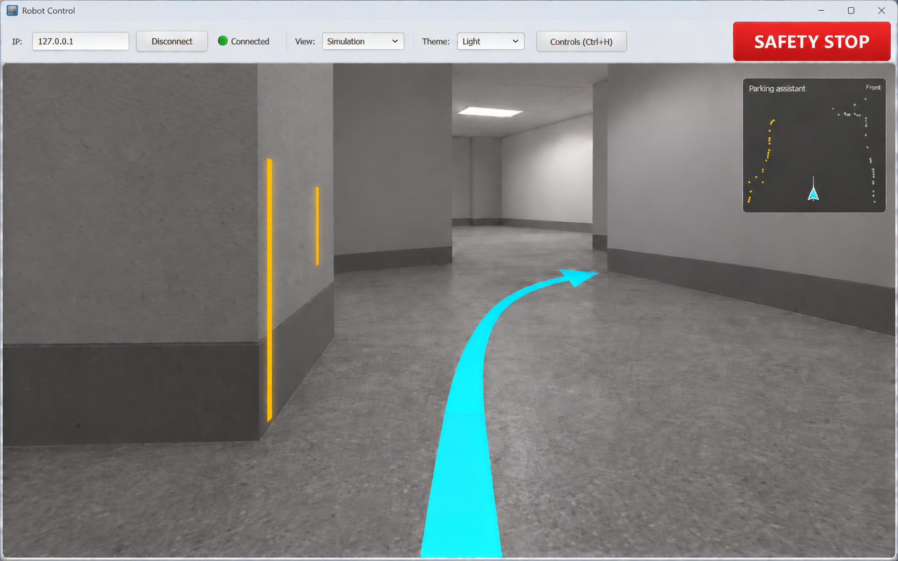
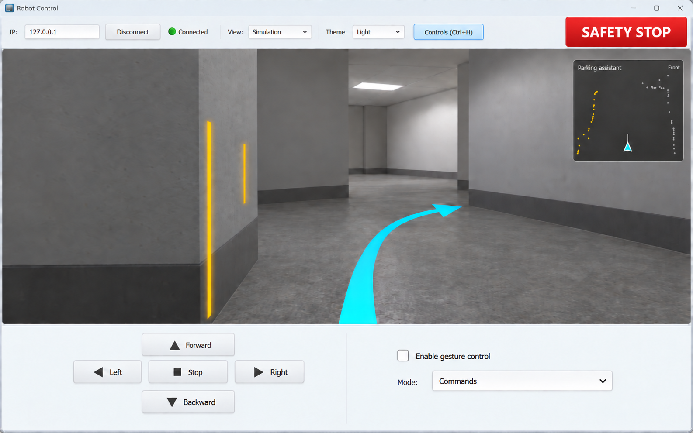
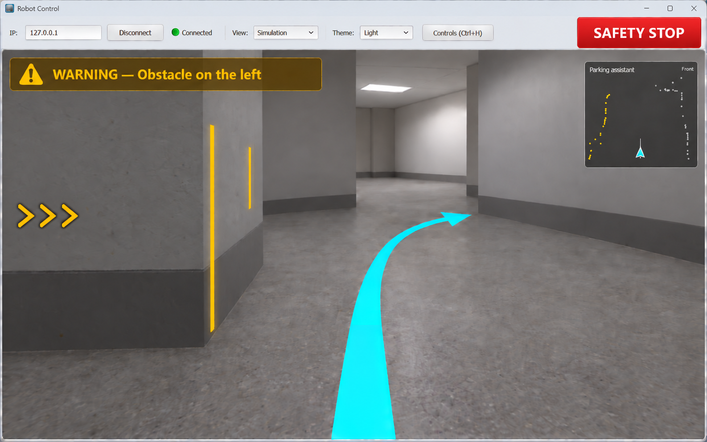
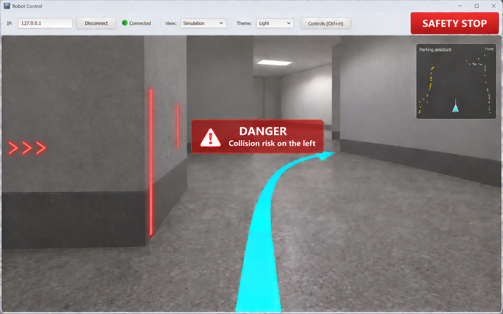
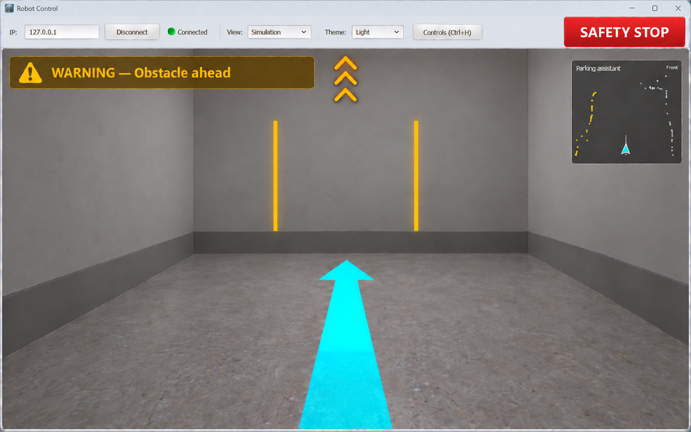
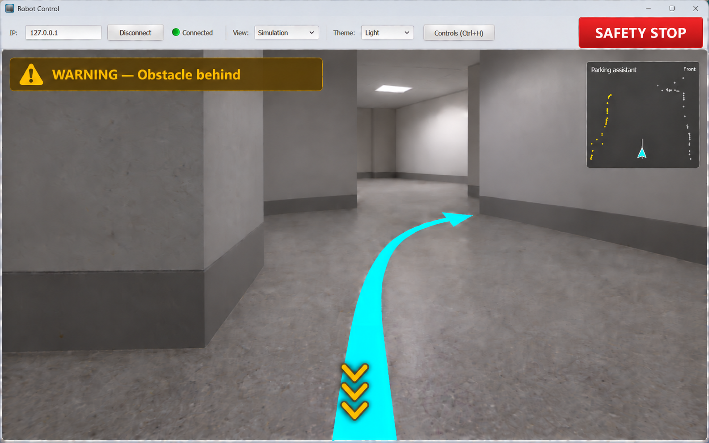

# HaMachI
Kopp &amp; Janicek on his way to HMI that aah

## Plán používateľského rozhrania

Táto časť opisuje plánovanú podobu a funkcie používateľského rozhrania pre Zadanie 1 z predmetu HMI v robotike.

### 1 Základné zobrazenie

Po spustení zaberá väčšinu okna obraz kamery. Spodný ovládací panel je skrytý. Viditeľné zostávajú pripojenie, výber obrazu, téma, Controls a veľké tlačidlo SAFETY STOP. Upozornenia sa zobrazujú iba pri príslušnej udalosti.

- **IP a Connect / Disconnect:** zadanie adresy a pripojenie. Po pripojení sa IP uzamkne, po odpojení sa opäť sprístupní. Text informuje o skutočnom stave spojenia.
- **View:** výber Camera alebo Simulation pre hlavný obraz. Nedostupný obraz sa označí textom No image data.
- **Theme:** výber svetlej alebo tmavej témy.
- **Controls / Ctrl+H:** zobrazí alebo skryje spodné ovládanie. Pri skrytí sa uvoľnený priestor použije na obraz kamery.
- **SAFETY STOP:** výrazné, zväčšené tlačidlo na vyžiadanie zastavenia; zostáva stále dostupné.

### 2 Informácie priamo v kamere

**Parkovací asistent:** menší pohľad prekrytý cez kamerový obraz v jeho pravom hornom rohu. Nezaberá samostatný stĺpec vedľa kamery.

**Fúzia lidar–kamera:** súvislé zvislé pásiky označujú miesta prekážok podľa lidarových meraní. Pozdĺž tej istej steny nasledujú za sebou: prvý bližšie k robotovi, ďalší ďalej. Každý pásik tvorí jeden celok. Zobrazenie závisí od nastaveného rozsahu vzdialeností a priestorového rozostupu označených miest. Rozostup v obraze zohľadňuje perspektívu. Farba sa mení zo žltej na červenú podľa závažnosti.

**Indikátory blízkej prekážky:** štyri pevné pozície pri okrajoch kamery upozorňujú na prekážky vľavo, vpravo, pred robotom a za ním. Každý indikátor tvoria presne tri zobáčiky. Vľavo majú tvar `>>>`, vpravo `<<<`. Horná trojica smeruje nahor a označuje prekážku pred robotom; spodná smeruje nadol a označuje prekážku za robotom. Pri poklese vzdialenosti pod nastavenú hranicu sa zobrazí príslušná trojica spolu s WARNING. Indikátory pre ostatné smery zostávajú skryté. Po vzdialení sa trojica aj upozornenie skryjú. Zobáčiky nemenia polohu podľa lidarových pásikov.

**Akčný zásah:** jedna výrazná šípka ukazuje smer pohybu robota. Pre jazdu rovno smeruje dopredu, pri zatáčaní sa zakriví doľava alebo doprava. Jej smer a zakrivenie sa menia podľa aktuálnych údajov o pohybe. Tvar šípky je súčasťou zobrazenia, smer nie je napevno nastavený.

### 3 Upozornenia

- **WARNING:** žlté alebo oranžové upozornenie v hornej časti obrazu kamery s krátkym popisom a smerom problému. Neprekrýva parkovacieho asistenta.
- **DANGER:** výrazné červené upozornenie v strede obrazu kamery. Zostáva viditeľné aj miesto nebezpečenstva; nezakryje celý obraz.
- Pri rovnakom probléme má DANGER prednosť pred WARNING. Po zániku problému sa hlásenie odstráni alebo zmení podľa aktuálneho stavu.
- Upozornenia nevytvárajú samostatný panel mimo obrazu kamery.

### 4 Ovládanie a zmena veľkosti

Po otvorení Controls sa zobrazia tlačidlá Forward, Left, Stop, Right a Backward. SAFETY STOP zostáva v hornom paneli. Skrytie Controls nemení zvolený zdroj obrazu ani stav upozornenia.

Pri zväčšení alebo zmenšení okna sa kamera prispôsobí dostupnému priestoru bez deformácie obrazu. Parkovací asistent zostane v pravom hornom rohu kamery, WARNING pri jej hornom okraji a DANGER uprostred. Trojice zobáčikov zostanú ukotvené pri príslušných okrajoch kamery. Prvky sa neprekrývajú s ovládaním. Rozloženie využije layouty, pružné medzery a spacery; minimálna veľkosť okna zachová dostupnosť tlačidiel.

### 5 Náhľady

Ilustračné návrhy vzhľadu; hodnoty a upozornenia sa pri behu menia podľa dát.

### Základné zobrazenie

### Zobrazené ovládanie

### WARNING

### DANGER

### Prekážka pred robotom

### Prekážka za robotom

